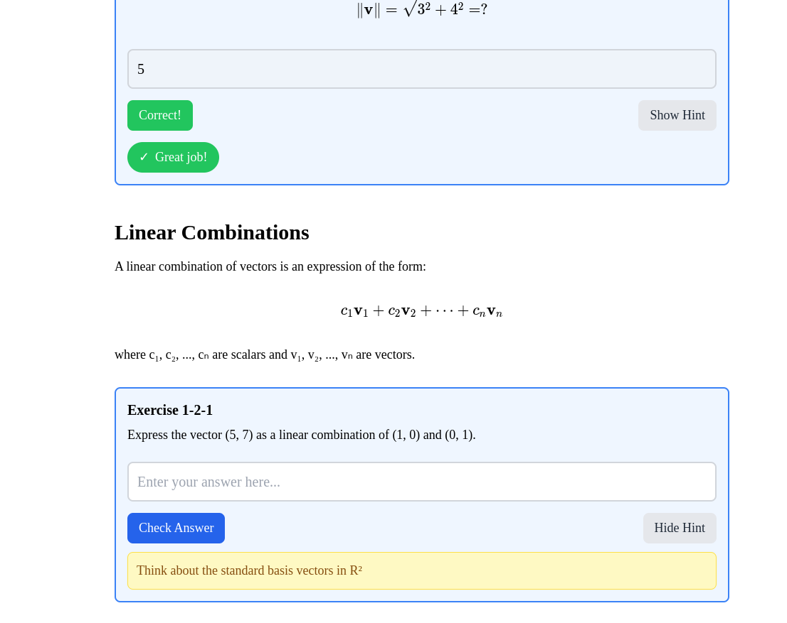

# Interactive Linear Algebra



An interactive web application for learning linear algebra through engaging lessons, visualizations, and exercises. Built with Next.js and React.

## ✨ Features

- **Interactive Lessons**: Step-by-step instruction with clear explanations
- **Visual Learning**: Mathematical visualizations rendered with KaTeX
- **Interactive Exercises**: Practice problems with immediate feedback
- **Progress Tracking**: Save your progress as you learn
- **Mobile-Friendly**: Responsive design works on all devices
- **Chapter-Based Learning**: Structured content organized by topic

## 🚀 Getting Started

### Prerequisites

- Node.js 18.0.0 or later
- npm or yarn

### Installation

1. Clone this repository
```bash
git clone https://github.com/yourusername/interactive-linear-algebra.git
cd interactive-linear-algebra
```

2. Install dependencies
```bash
npm install
# or
yarn install
```

3. Generate content from PDF (optional)
```bash
node scripts/generate-content.js
```

4. Start the development server
```bash
npm run dev
# or
yarn dev
```

5. Open [http://localhost:3000](http://localhost:3000) in your browser

## 📚 Content

The application covers fundamental linear algebra topics including:

- Vector operations and properties
- Matrix operations and transformations
- Vector spaces and subspaces
- Linear transformations
- Eigenvalues and eigenvectors
- And more!

## 🛠️ Technology Stack

- **Framework**: Next.js 14 with App Router
- **Frontend**: React 18 with TypeScript
- **Styling**: Tailwind CSS
- **Math Rendering**: KaTeX via react-katex
- **Content**: Markdown support via react-markdown
- **PDF Processing**: pdf-parse for extracting content

## 📁 Project Structure

- `interactive-linear-algebra/` - Main Next.js application
  - `src/app/` - Pages and routing
  - `src/components/` - Reusable React components
  - `src/data/` - Structured content from PDF
  - `src/utils/` - Utility functions including PDF parser
  - `scripts/` - Content generation utilities

## 📄 License

This project is licensed under the MIT License - see the [LICENSE](LICENSE) file for details.

## 🙏 Acknowledgments

- Based on an open-source linear algebra textbook
- Built with Next.js and React
- Math rendering powered by KaTeX